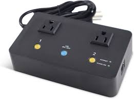

# Web Switch Project

Web switch control for these products:

 * PI Manufacturing ETPW-622B
 * 5Gstore IP Switch UIS-622B
 


## Usage

```
web-switch.sh - ETPW-622B/UIS-622B web-switch control.
Usage: web-switch.sh [flags]
Option flags:
  -h --help    - Show this help and exit.
  -v --verbose - Verbose execution.
  -c --config  - Configuration file. Default: 'web-switch.conf'.
  -t --target  - Target outlet {uis 1 2 all}. Default: 'all'.
  -a --action  - Action {off on toggle reset status}. Default: 'status'.
```

## Info

 * [Programming Note](notes/packet-request-via-http.pdf)
 * [ETPW-622B Setup Manual](notes/etpw-622b-setup-manual.pdf)
 * [UIS-622B User Manual](notes/IPSwitchManual_Nov_2019_rev3.pdf)
